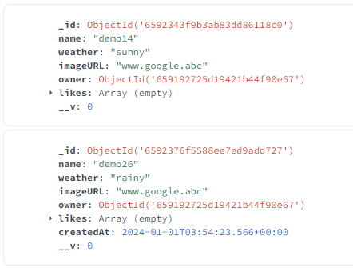

# WTWR Domain

[Link to the site](https://wtwr.themoosebarn.com)

Domain: wtwr.themoosebarn.com

[Link to front-end repository](https://github.com/eaakre/se_project_react)

## WTWR (What to Wear?): Back End

This project is focused on creating a server for the WTWR application. It is connected to a MongoDB database with users and clothing items. The eventual goal is to create a server with an API and user authorization.

## Tech

This project uses Express, Node, and MongoDB to create the back-end/database for the WTWR app.

## Screenshots

